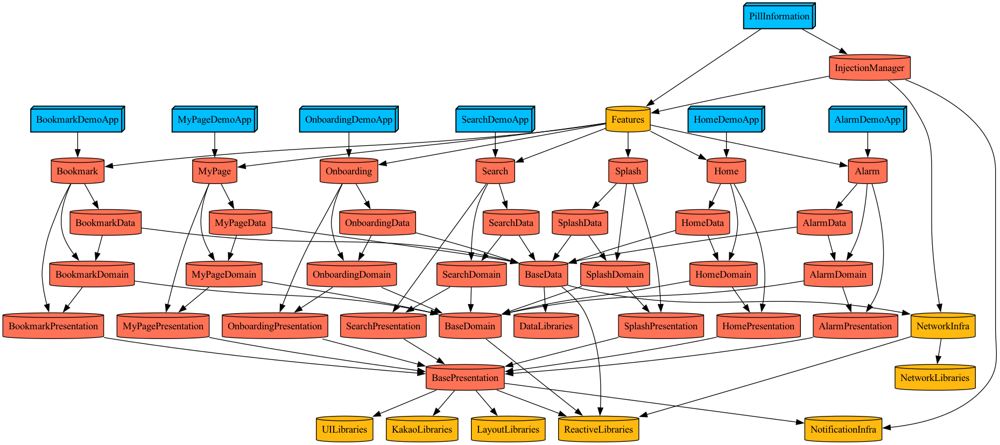

# PillInformation




<br>

## Commend LIne Tool (Generating Xcode project)

|Name|Version|
|:--:|--|
|Tuist|4.9.0|

```
brew tap tuist/tuist
brew install --formula tuist@4.9.0

# 만약 tuist가 설치되어 있는 경우
brew link --overwrite tuist@4.9.0
```

<br>

## Third-party libraries

|Name|Version|-|
|:--:|-------|---|
|RxSwift|6.6.0|ReactiveLibraries|
|RxGesture|4.0.4|ReactiveLibraries|
|ReactorKit|3.2.0|ReactiveLibraries|
|Alamofire|5.9.1|NetworkLibraries|
|Moya|15.0.0|NetworkLibraries|
|RealmSwift|10.49.1|DataLibraries|
|Quick|7.6.2|TestLibraries|
|RxTests|(RxSwift)|TestLibraries|
|RxBlocking|(RxSwift)|TestLibraries|
|RxNimble|6.3.1|TestLibraries|
|FlexLayout|2.0.07|LayoutLibraries|
|PinLayout|1.10.5|LayoutLibraries|
|SkeletonView|1.30.4|UILibraries|
|Kingfisher|7.11.0|UILibraries|
|DropDown|2.3.13|UILibraries|
|Tabman|3.2.0|UILibraries|
|Pageboy|4.2.0|UILibraries|
|lottie|4.4.1|UILibraries|
|AcknowList|3.2.0|UILibraries|
|kakaoSDK|master|KakaoLibraries|


